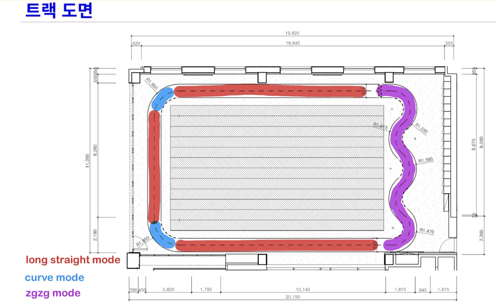
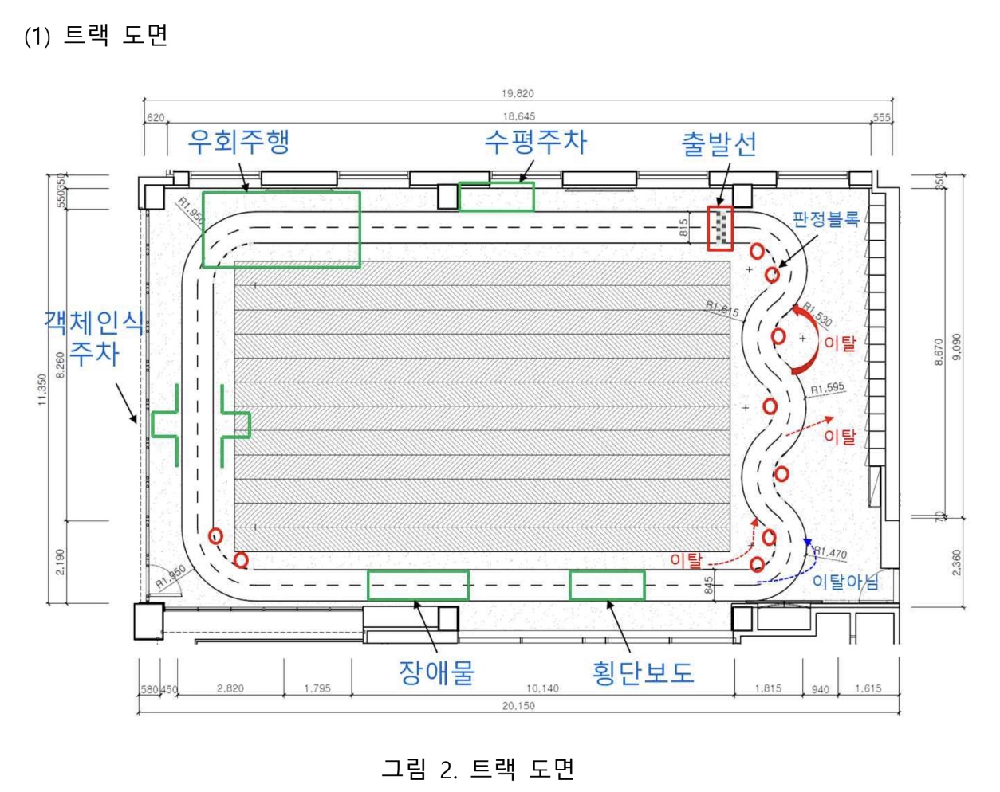
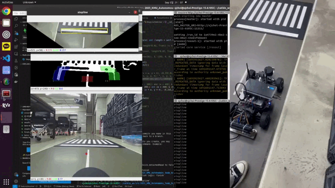

# 2023 국민대 자율주행 경진대회: Team AuTURBO rookie
# 예선미션 Repo

[Repo Link](https://github.com/ggh-png/2023_KMU_driving_simulation-AuTURBO_rookie)
# 1. High Speed Driving

## 1) Line Tracking

> line detecting and line control
> 

---

### workflow

lane detection mode 

1. Bird eye view
2. HSV filtering
3. sliding window
4. 왼쪽, 오른쪽 차선 구분
5. 차선 각도 예외처리 && 오차값 생성
6. 위 오차값을 이용한 조향각 Pure Pursuit 제어

## 2) Mode Control
> Highest speed on a straight road & optimal speed on a curve
> 

---

### workflow

1. long straight mode - 직선주로 고속주행
2. curve mode - 곡선주로 최적주행
3. zgzg mode - 지그재그 최적주행

# 2. Mission Driving

## **Mission 1** - Parallel Parking

> line detecting and line control
> 

---

### workflow

1. find parallel parking mode - ar mark 인식 
2. parallel parking mode - 주차공간 인식 
3. ar parking mode - ar 정밀주차 후 ar courve mode 실행 

## **Mission 2** - AR Curve

> AR detecting and AR curve control
> 

---

### workflow

**ar curve mode**

1. 일정거리 
2. ar curve control mode 

## **Mission 3** - Object Detecting Parking

> Object Detecting and Vertical Parking
> 

---

### workflow

1. find vertical parking mode -  특정 차량 감지 및 주차공간 인식
2. vertical parking mode - 수직주차 실행

## **Mission 4** - Obstacle Avoidence

> Obstacle detecting and avoidence
> 

---

### workflow

**obstacle mode**

1. 전방의 장애물 인식 (오른쪽/왼쪽)
2. 휴리스틱 장애물 회피 주행

## **Mission 5** - Stop Line

> StopLine detecting and stop control
> 

---

### workflow

**stop line mode**

1. Bird eye view 변환 및 전처리
2. CV 사각형 감지
3. 특정 크기 이상의 사각형 감지시 stopline으로 인식
4. stopline 인식 후 6초 정지

## **Mission 6** - Rubber Tracking

> Rubber detecting and Rubber control
> 

---

### workflow

**rubbercon  mode**

1. 라바콘 회피 주행모드 시작
2. 특정 거리 이내에서 장애물 인식 전 flag = 0
3. 특정 거리 이내에서 장애물 인식시 flag = 1, 그리고 양 쪽 장애물과 차와의 거리의 오차값을 중첩시켜 조향각을 제어
4. flag가 1 이면서 장애물이 인식되지 않았을 때 루버콘 모드 종료, 다음 모드 실행
